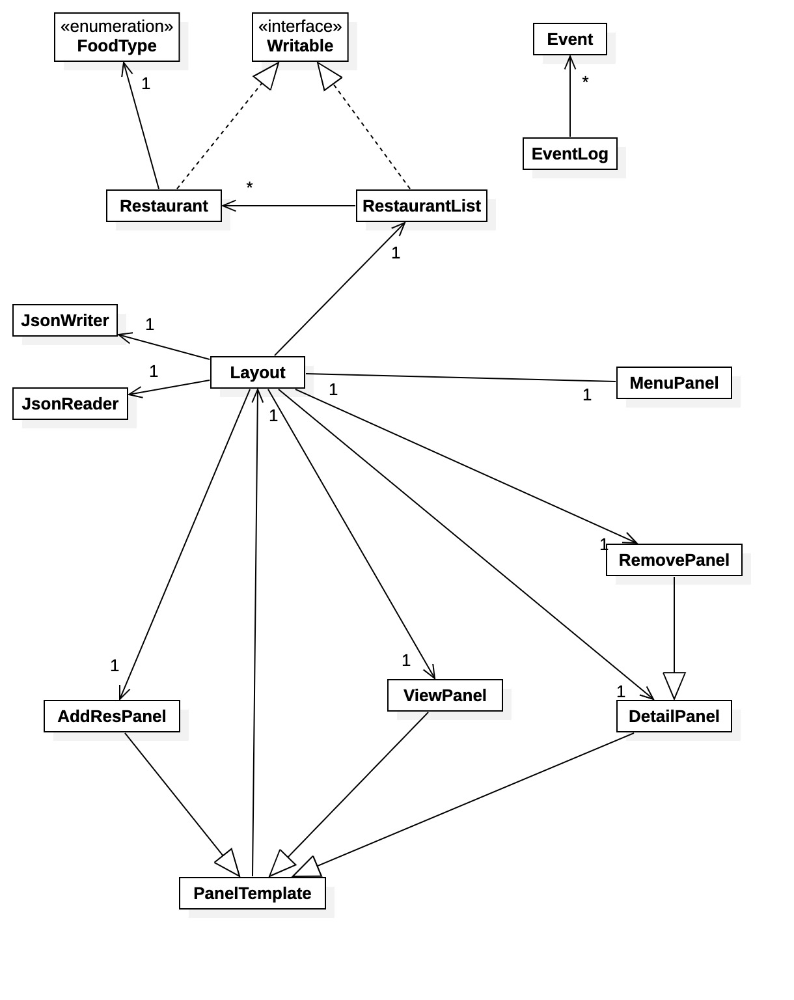

# UBC CPSC 210 Personal Project
## UBC Food Yelp

This application collect **food information** within UBC with its location, food type, ratings and comments from students. 
The target users are UBC students, staff and visitors.

As a foodie, when I first came to UBC, it was hard to find a place to grab lunch/drink. Google and Yelp are not that helpful, and it also caused some bad experiences. 
Hope this application can give UBCers some guidance in food choice.

**User Stories**
- As a User, I want to be able to create new restaurant and add it to a list of food information
- As a User, I want to be able to view a list of the name and basic info of the restaurant 
- As a User, I want to be able to select a restaurant in the information list and leave a rating(0-5) and comment
- As a User, I want to be able to select a restaurant in the information list and view it in details
- As a user, when I start the application, I want to be given the option to load my restaurants list from file.
- As a user, when I quit the application, I want to be able to save my restaurants list to file.

**Phase4: Task2**

***Sample of the events log that occur when program runs***
```
Thu Nov 18 23:14:53 PST 2021
Sesame Restaurant Added 
Thu Nov 18 23:14:53 PST 2021
JJ Bean Coffee Roasters Restaurant Added
Thu Nov 18 23:14:53 PST 2021
Uncle Fatih’s Pizza - UBC Restaurant Added
Thu Nov 18 23:14:53 PST 2021
Kokoro Tokyo Mazesoba - UBC Restaurant Added
Thu Nov 18 23:14:53 PST 2021
Jamjar Canteen Restaurant Added
Thu Nov 18 23:14:57 PST 2021
Uncle Fatih’s Pizza - UBC Restaurant Removed
```

**Phase 4: Task 3**

UML:


Future Improvement:
1. Make rating and comment buttons work.
2. Add an appropriate layout to the menu panel.
